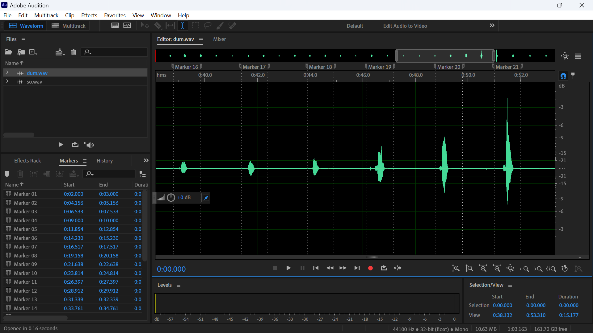
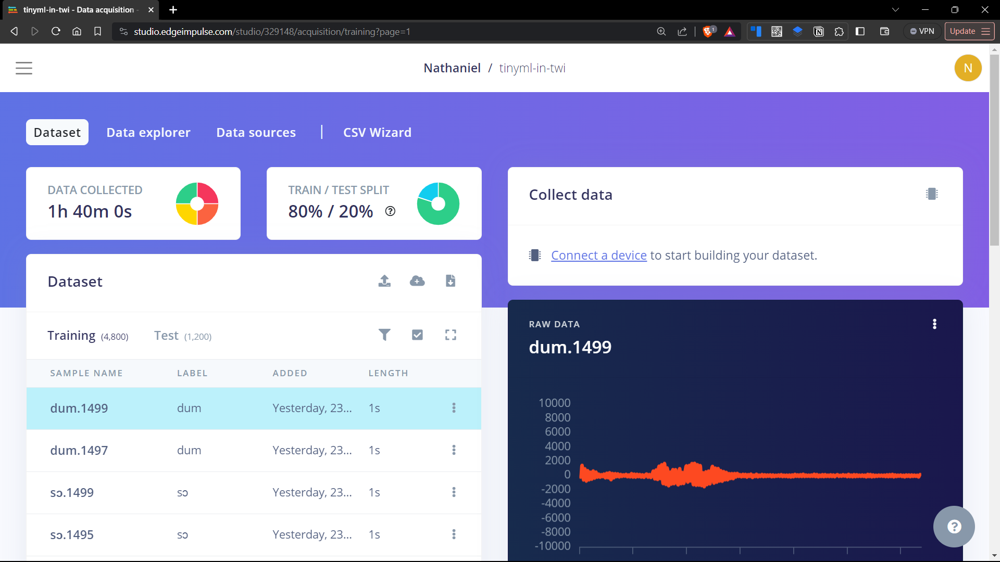
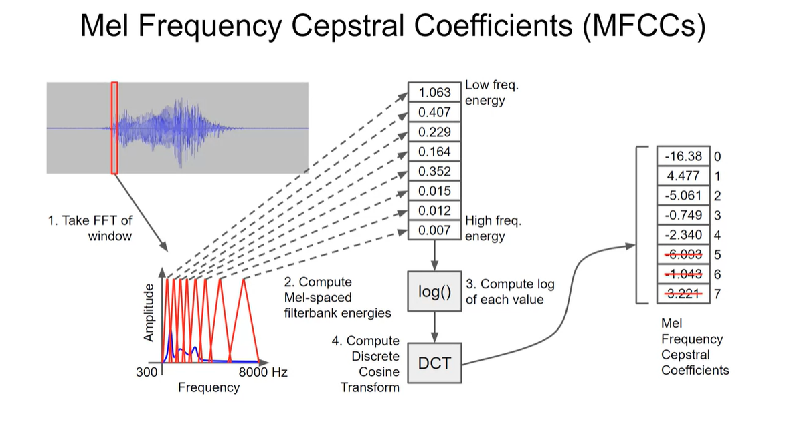
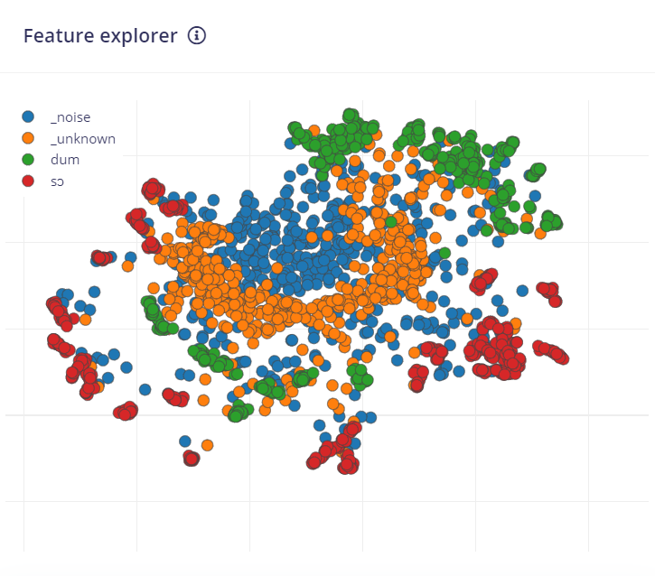
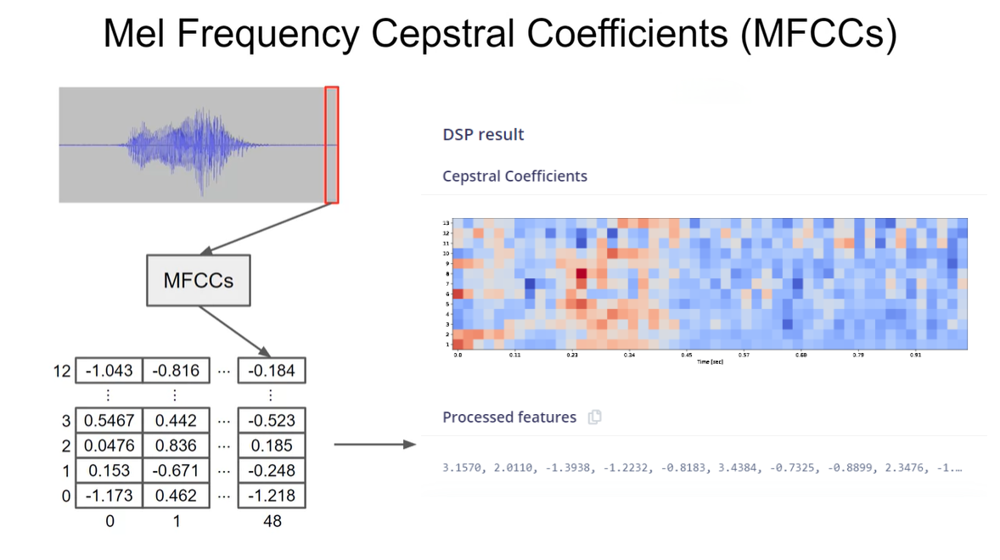
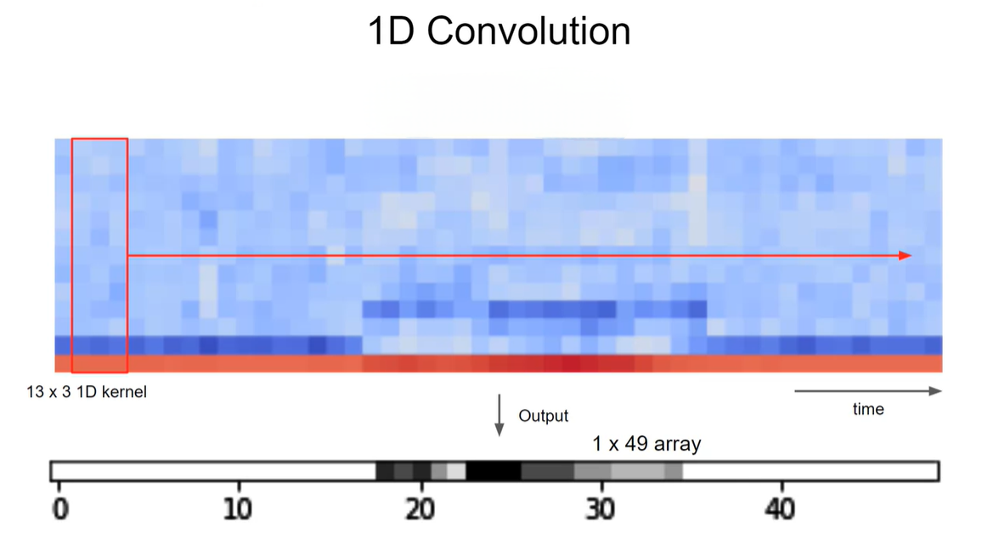
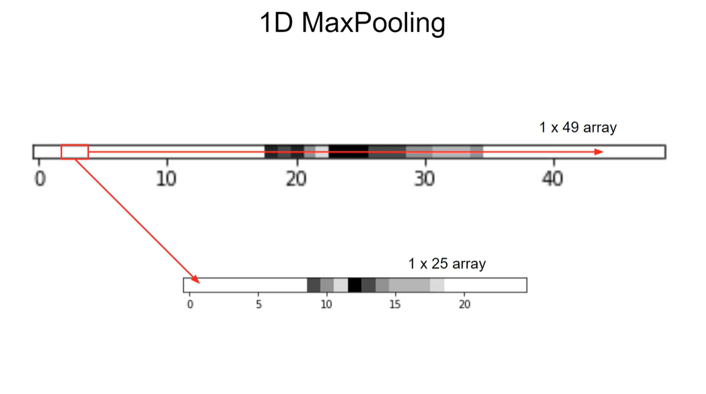
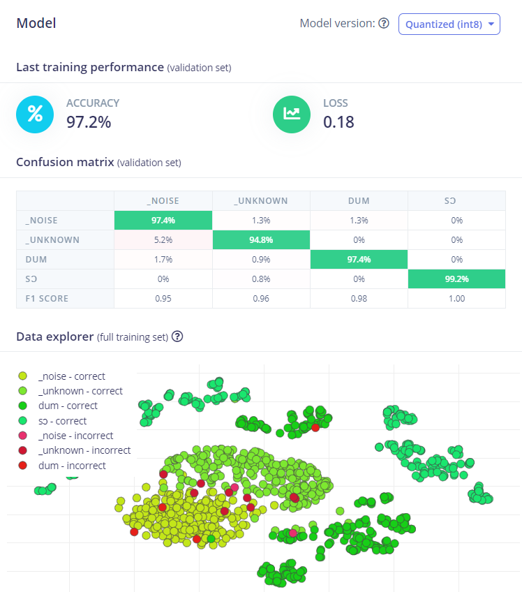
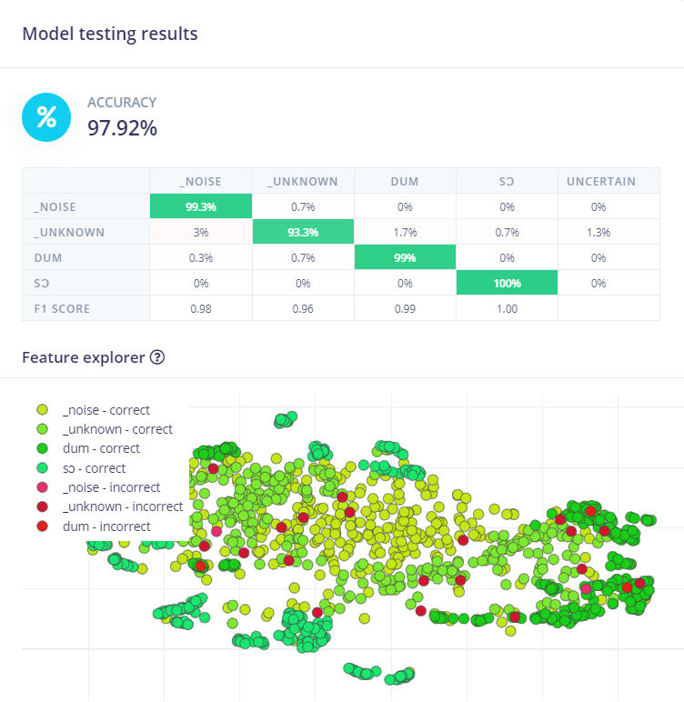

# TinyML in Twi: Voice-Controlled Lamp for Home Automation in Ghanaian Homes

<!-- image of project -->


This project presents a practical application of tinyML, focusing on home automation through voice control in Twi, a major Ghanaian dialect. Leveraging a machine learning model trained via Edge Impulse on numerous Twi audio samples, the system recognizes the commands 'Sɔ' and 'Dum'—Twi for 'on' and 'off'—to control a lamp. This approach addresses the linguistic barrier faced by many Ghanaians when interacting with technology, which typically centers around English and other major foreign languages. By enabling Twi speakers to operate home devices with their native language, the project not only fosters inclusivity but also paves the way for integrating other local languages into technological interfaces.


## Acknowledgements

This project was motivated by the valuable insights gained from [Shawn Hymel's](https://github.com/ShawnHymel) [Introduction to Embedded Machine Learning course](https://www.coursera.org/learn/introduction-to-embedded-machine-learning/) on Coursera.

Also, the foundational resources provided in Shawn Hymel's [Keyword Spotting with Edge Impulse repository](https://github.com/ShawnHymel/ei-keyword-spotting), which includes a suite of tools and demo projects, were instrumental in kick-starting my own work.

Particularly, his [`dataset-curation.py`](https://github.com/ShawnHymel/ei-keyword-spotting/blob/master/dataset-curation.py) script was instrumental in the process of data curation and augmention. It enabled the seamless integration of custom keywords in Twi with the [Google Speech Commands dataset](http://download.tensorflow.org/data/speech_commands_v0.02.tar.gz) and the incorporation of background noise into the samples, both of which were vital to the success of this project.


## Stuff
### Hardware
  * [Arduino Nano 33 BLE Sense rev2](https://store.arduino.cc/products/nano-33-ble-sense-rev2)
  * LED Bulb
  * 5V Relay Module
  * Jumper Wires
  * Breadboard

### Software & online services
  * [Arduino IDE](https://www.arduino.cc/en/software)
  * [Edge Impulse Studio](https://studio.edgeimpulse.com/)
  * [Adobe Audition](https://www.adobe.com/products/audition.html)
  * [Google Colab](https://colab.research.google.com/)


[regenerate stuffs with Github copilot when done documenting]

## Methodology
### 1. Data Collection

I utilized a standard recording application on my smartphone to capture voices saying the Twi keywords 'Sɔ' and 'Dum'. Each recording session lasted just over `a minute or nn minutes`, with the keywords spoken at least `50 or nn` times at intervals of 1-2 seconds by various individuals to ensure a diverse dataset. After recording, I transferred these audio files to the [`dataset/keywords_raw/`](/dataset/keywords_raw/) directory.

For the processing and extraction of precise 1-second keyword samples, I used Adobe Audition. While [Audacity](https://www.audacityteam.org/) is a beginner-friendly alternative, my familiarity with Audition allowed for a more efficient workflow, particularly due to its feature for [marking and extracting multiple ranges of audio](https://youtu.be/tOF4FtYlh6Y).

In Adobe Audition, I placed markers around the desired 1-second samples and exported them into the [`dataset/keywords_exported/`](/dataset/keywords_exported/) folder as .wav files, the audio format compatible with the Edge Impulse platform. These were organized into two separate folders, labeled according to the respective Twi keywords.



The outcome of this process was a total of `50nnn` .wav files, evenly divided, with an equal number of `25nnn` samples for each keyword.

Tree structure of the unprocessed dataset:
```
dataset/
├── keywords_exported/
│   ├── dum/
│   │   ├── dum_001.wav
│   │   ├── dum_002.wav
│   │   ├── ...
│   │   └── dum_025.wav
│   ├── sɔ/
│   │   ├── sɔ_001.wav
│   │   ├── sɔ_002.wav
│   │   ├── ...
│   │   └── sɔ_025.wav
│   └── ...
└── ...
```

> [!NOTE]
> During the export phase, I downsampled the audio samples from their original 44.1 kHz to 16 kHz and reduced the bit depth from 32-bit float to 16-bit PCM. This adjustment is in line with the specifications of the Arduino Nano 33 BLE Sense rev2 which samples at 16 kHz with a 16-bit depth.  
> Although these modifications are typically handled by the `dataset-curation.py` script during the post-augmentation phase, I preemptively applied these settings to ensure compatibility and facilitate potential adjustments in future project phases.


### 2. Data Curation and Augmentation

Building the final dataset began with integrating the custom keyword recordings with Google's Speech Commands dataset, which offers an extensive collection of spoken words. This fusion was crucial for adapting the model to recognize my specific Twi keywords, while also benefiting from the breadth of Google's data.

I implemented data augmentation to enhance the dataset's diversity, which is key to developing a resilient model. This process included blending various background noises into the original recordings to simulate different listening environments and generate new versions of the same sample.

To streamline the augmentation process, I utilized the [Google Colab script](https://colab.research.google.com/github/ShawnHymel/ei-keyword-spotting/blob/master/ei-audio-dataset-curation.ipynb) provided by Shawn Hymel rather than configuring a local Python environment.

The script managed the merging of the background sounds with the custom keywords and maintained uniformity across the dataset by standardizing the sample rate and bit depth to 16 kHz and 16 bits, with a duration of 1 second for each audio clip.

The augmentation resulted in a well-organized dataset, categorized into:
  * **_noise**: containing clips solely of background noise
  * **_unknown**: encompassing all non-target words
  * **Sɔ**: the keyword to activate the lamp
  * **Dum**: the keyword to deactivate the lamp

The dataset, balanced across these four categories, comprised 1500 one-second clips per class. I transferred the completed dataset to the [`dataset/keywords_curated/`](/dataset/keywords_curated/) directory on my local machine, ready for the data upload phase.

Tree structure of the curated and augmented dataset:
```
dataset/
├── keywords_curated/
│   ├── _noise/
│   │   ├── _noise.0001.wav
│   │   ├── ...
│   │   └── _noise.1499.wav
│   ├── _unknown/
│   │   ├── _unknown.0001.wav
│   │   ├── ...
│   │   └── _unknown.1499.wav
│   ├── dum/
│   │   ├── dum.0001.wav
│   │   ├── ...
│   │   └── dum.1499.wav
│   ├── sɔ/
│   │   ├── sɔ.0000.wav
│   │   ├── ...
│   │   └── sɔ.1499.wav
│   └── ...
└── ...
```


### 3. Data Upload

The next step involved uploading the curated dataset to my Edge Impulse project. Having already [installed Edge Impulse](https://docs.edgeimpulse.com/docs/tools/edge-impulse-cli/cli-installation), I utilized the Edge Impulse CLI (Command Line Interface) to batch-upload the contents of the [`dataset/keywords_curated/`](/dataset/keywords_curated/) directory. During the upload process, I configured the command to randomly distribute the samples between training and testing sets in an 80:20 ratio, which is a standard practice for machine learning datasets to ensure that the model is tested on unseen data

The terminal commands used for this process were:
```
cd dataset/keywords_curated
edge-impulse-uploader --category split --api-key "ei_123.." "_noise/*.wav" --project-id "123.."
edge-impulse-uploader --category split --api-key "ei_123.." "_unknown/*.wav" --project-id "123.."
edge-impulse-uploader --category split --api-key "ei_123.." "dum/*.wav" --project-id "123.."
edge-impulse-uploader --category split --api-key "ei_123.." "sɔ/*.wav" --project-id "123.."
```

> [!NOTE]
> The API key and project ID details are obscured to prevent unauthorized access.

Post-upload, I conducted a verification step on the Edge Impulse platform under the 'Data Acquisition' tab. I confirmed that the training and testing datasets comprised a total of 100 minutes of audio, with samples uniformly distributed across the defined classes. The training and testing sets were split in an 80:20 ratio.




### 4. Audio Feature Extraction

Training the model without a feature extraction—on the raw audio—could result in the model learning based on volume and position of utterence. These features would not make ensure an accurate and robust model. It was necessary to extract features that mimic how humans perceive sounds.

 * For each audio clip, the Fast Fourier Transform (FFT) is obtained over a 1000 millisecond frame, with a stride of 500 milliseconds between successive frames. Frequencies below 300 Hz were excluded as they generally do not contain information pertinent to human speech.

 * From the FFT data, Mel Frequency Cepstral Coefficients (MFCCs) are computed using 32 mel-scale filters. Of these, the first 13 coefficients were retained and the rest discarded, as the initial coefficients sufficiently characterize the speech spectrogram's shape and are most relevant for speech recognition tasks.

    
    <br><br>
    

 * This process was repeated across the audio sample to produce 49 overlapping frames, each yielding 13 MFCCs. The end result of this MFCC computation resembled a two-dimensional representation akin to an image, capturing the essential characteristics of the sound over time.

    


### 5. Convolutional Neural Network (CNN) Training

Given that MFCC analysis results in an image-like representation, a CNN was the optimal choice for model training.

Here is a breakdown of the network architecture:

 * **Input Layer:** The model starts with an input layer of 650 nodes representing the MFCC features.

 * **Reshape Layer:** This layer restructures the input into a 13-column matrix, enabling image-like processing in subsequent convolutional layers.

 * **1D Convolution/Pooling Layer:** The reshaped data is processed through a 1D convolutional layer with 8 neurons, using a kernel size of 3. This enables the detection of patterns over three adjacent features. A max pooling operation with 1x2 window size follows, reducing computational load and enhancing feature detection robustness.

    
    <br><br>
    

 * **Dropout Layer:** A dropout layer with a 0.25 rate is used to mitigate overfitting, by randomly omitting a quarter of neurons during training.

 * **Second 1D Convolution/Pooling Layer:** Another 1D convolutional layer with 16 neurons (kernel size of 3) captures complex patterns, followed by a max pooling layer.

 * **Second Dropout Layer:** Similar to the first, this dropout layer has a 0.25 rate to further prevent overfitting.

 * **Flatten Layer:** The data is flattened to transform the multi-dimensional convolutional outputs into a single long vector, preparing it for the final classification layer.

 * **Output Layer:** The network ends with an output layer with 4 nodes, each representing a class to be identified.

Training hyperparameters:
 * Epochs: 100 training cycles
 * Learning Rate: 0.005
 * Validation Set: 20% of the data
 * Batch Size: 32


The model achieved a remarkable **97.2%** accuracy and a loss of **0.18** on the validation set, reflecting its effectiveness in classifying the audio samples.



### 6. Model Testing

The effectiveness of the model was evaluated using the designated test dataset, which consisted of audio samples not used during the training phase. This step is crucial to assess the model's performance in recognizing keywords in unseen data.

In these tests, the model demonstrated a high level of accuracy, achieving **97.92%**. This result was obtained under the condition of setting a minimum confidence threshold of **0.6**, ensuring that predictions made by the model met a standard level of certainty. This high accuracy rate indicates the model's robustness and reliability in keyword detection in real-world scenarios.




### 7. Model Deployment

The final step of the project involved deploying the model to the Arduino Nano 33 BLE Sense rev2. This process was facilitated by the Edge Impulse platform, which provides a library of pre-built examples for various hardware platforms.

## Results and Discussion


<!--

## Watch the Project Video
[](https://www.youtube.com/watch?v=HQruk8vdTt4)

## Repository Contents
  * A list of the files and folders in the repository
  * Include description of each file
    ### Example
      * **src/** - Source code of the project
      * **docs/** - Documentation of the project
      * **images/** - Images used in the documentation
      * **README.md** - This file

## Contribution
  * Provide guidelines for how other developers can contribute to the project
  * Include how to set up a development environment and how to submit pull requests

## License
  * Information on the licensing of the project
  * 

-->
    